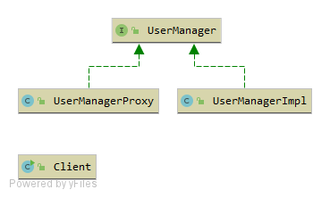
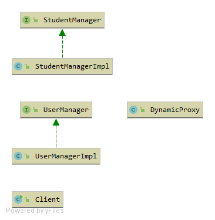
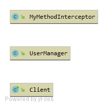
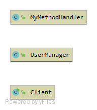

## GOF代理模式 - proxy

## StaticProxy
静态代理

优点：
> 隐藏具体实现，一定程度上解耦

缺点：
> 代理类和目标类需要同时实现接口，代码冗余
> 静态代理只能对固定的接口进行代理，灵活性差

## DynamicProxyJDK
JDK原生动态代理

原理：
>通过反射实现目标类方法调用

优点：
> 只需将目标类传入代理类即可，灵活性强
> 代理只需要实现invoke()方法，实现简单，降低冗余

缺点：
> 只能基于接口代理

## DynamicProxyCGLib
基于CGLib的动态代理

原理：
> fastclass方式生成被代理类的子类，通过子类实现方法拦截及目标方法调用

优点：
> 更快更灵活

缺点：
> final方法无法代理

## DynamicProxyJavassist
基于Javassist的动态代理

原理：
> 动态生成字节码

优点：
>

缺点：
>

## 基于asm的动态代理

//TODO